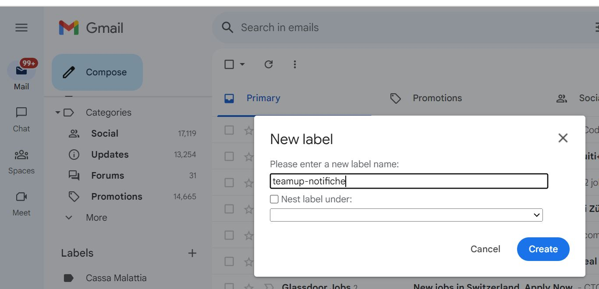
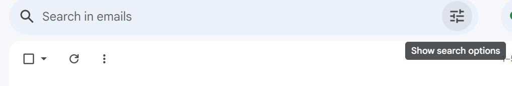
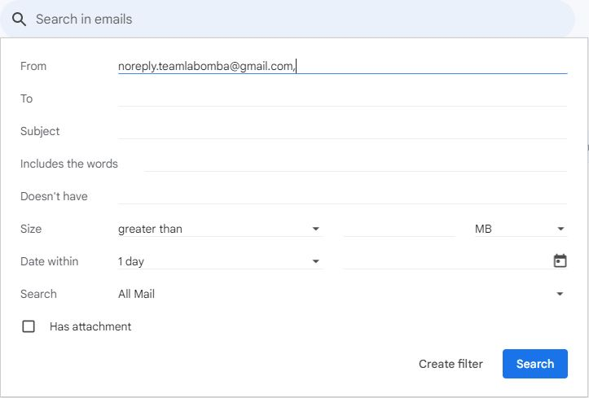
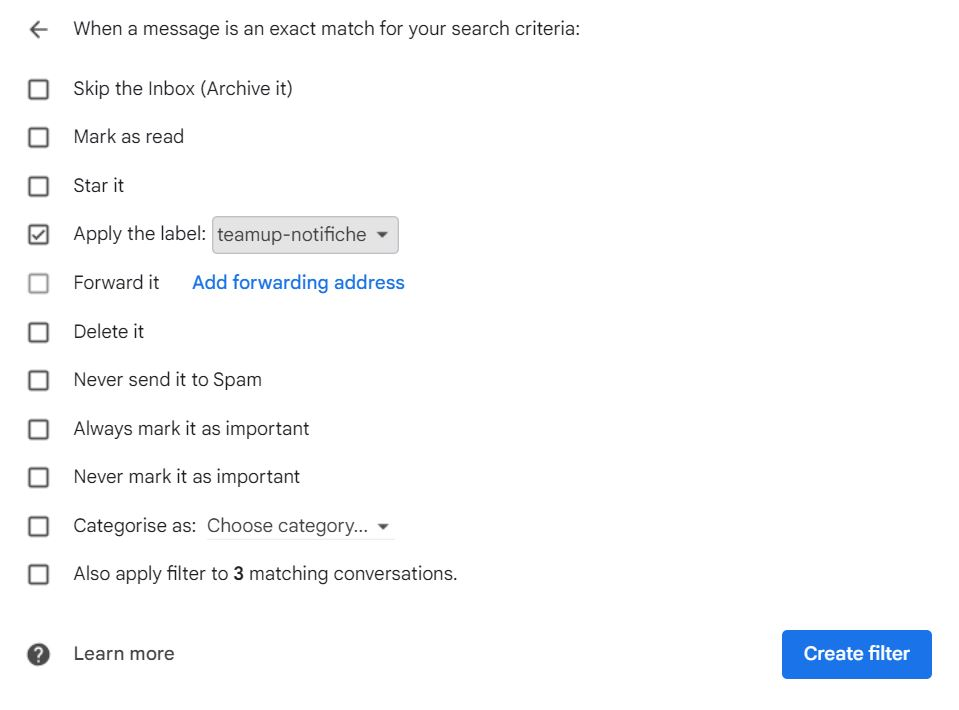

# Gestione notifiche - guida all'uso

Le notifiche dell'applicazione teamup sono gestite via email. Di seguito è presentato un modo semplice ed efficace per ricevere le notifiche dall'applicazione. La guida di seguito si riferisce agli account gmail.

#### Etichetta

Per creare un'etichetta, accedere all'account email associato all'account dell'app, in seguito:

1. Cliccare sul bottone Menu in altro a sinistra
2. Scorrere fino ad individuare la sezione etichette (labels)
3. Cliccare su "+"
4. Scegliere un nome per l'etichetta

#### Filtro

All'etichetta creata si deve associare un filtro per gestire le mail di notifica.

1. Cliccare sul bottone nella barra di ricerca
   
2. Inserire la mail noreply.teamlabomba@gmail.com
   
3. Cliccare su "crea filtro"
4. Selezionare l'etichetta creata e ""ignora posta in arrivo" ("skip the inbox")

   

#### Impostazioni notifiche su app gmail

A questo punto rimane da settare le impostazioni di notifica su gmail

1. Aprire il menu a sinistra (bottone con 3 barre orizzonali)Selezionare "Impostazioni"
2. Selezionare l'account gmail associato all'account sull'app
3. "Notifiche" -> "Gestisci etichette"
4. Selezionare la propria etichetta
5. Cliccare "Sincronizza messaggi" e scegliere "Tutte" oppure "Ultimi 30 giorni"
6. Selezionare "Aggiungi etichette alle notifiche" e "notifica per ogni messaggio" (se si desidera emettere vibrazione-suono per ogni messagio)
